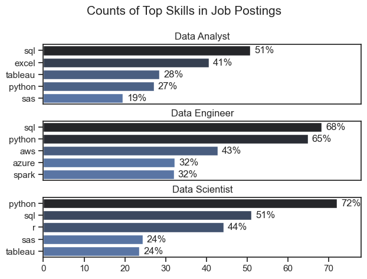
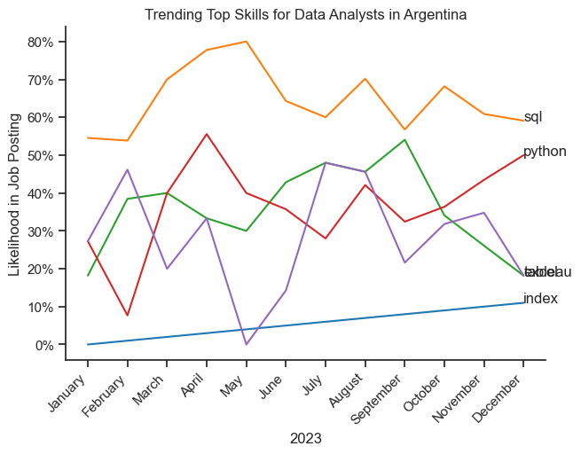
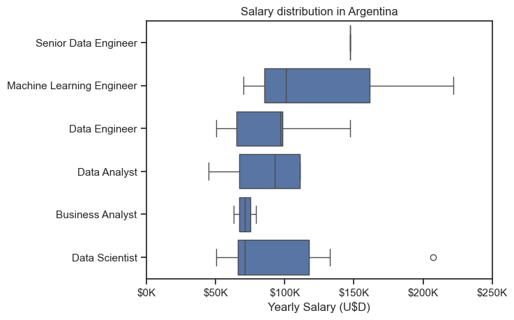
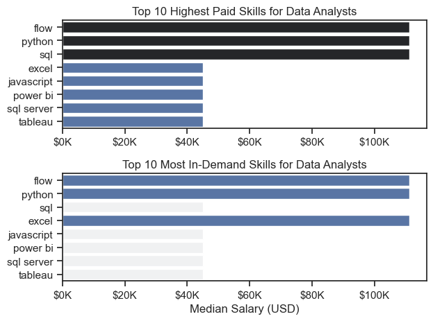
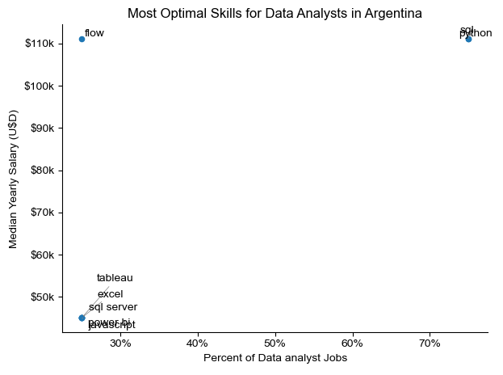

# Overview

Welcome to my analysis of the data job market, based on an existing DataSet, focusing on Data Analyst roles. This project was created out of curiosity to understand the basic tools needed to understand python. It navigates the job market and the skills needed to aboard it.

The data sourse is [Luke Barousse's Python Course](https://www.youtube.com/watch?v=wUSDVGivd-8&t=2s) which provides a foundation for this analysis. Through a series of Python scripts, I explore key question for the analysis, such as skills, salary trends, etc.

# The Questions

1. What are the skills most in demand for the top most popular data roles?
2. How are in-demand skills trending for Data Analysts?
3. How well do jobs and skills pay for Data analysts?
4. What are the optimal skills for Data Analysts to learn?

# Tools I Used

For my analysis on the job market, I used several key tools:
- Python: The backbone of this analysis. I used the following Python libraries:
    - Pandas: for analyzing the data.
    - Matplotlib: to visualize the data.
    - Seaborn: to create advanced visuals.
- Jupyter Notebooks: the tools I used to run Python scrpts.
- Visual Studio Code: for executing Python scripts.
- Git & GitHub: used for version control and as a sharing tool for this project.

# The Analysis

## 1. What are the most demanded skills for the top 3 most popular data roles?

To find the most demanded skills for the top 3 most popular data roles. I filtered out those positions by which ones were the most popular, and got the top 5 skills for these top 3 roles. This query highlights the most popular job titles and their top skills, showing which skills I should pay attention to depending on the role I'm targeting.

View my notebook with detailed steps here: [2_Skills_Count.ipynb](3_Project\2_Skills_Count.ipynb)

### Visualize Data

```fig, ax = plt.subplots(len(job_titles), 1)

for i, job_title in enumerate(job_titles):
    df_plot = df_skills_perc[df_skills_perc['job_title_short'] == job_title].head(5)
    sns.barplot(data=df_plot, x='skill_percent', y='job_skills', ax=ax[i], hue='skill_count', palette='dark:b_r')

plt.show()
```

### Results




### Insights

- Python is a very versatile skills, highly demanded across all three roles, but most prominentyl for Data Scientists (72%) and Data Engineers (65%).
- SQL is the most requestes skill for Data Analysts and Data Scientists, with it in over half the job postings for both roles. For Data Engineers, Python is the most sought-after skill, appearing in 685 of job postings.
- Data Engineers require more specialized technical skills (AWS, Azure, Spark) compared to Data Analysts and Data Scientists who are expected to be proficient in more general data management and analysis tools (Excel, Tableu).

## 2. How are in-demand skills trending for Data analysts?

### Visualize Data

```python
from matplotlib.ticker import PercentFormatter

df_plot = df_DA_US_percent.iloc[:, :5]
sns.lineplot(data=df_plot, dashes=False, legend='full', palette='tab10')

plt.gca().yaxis.set_major_formatter(PercentFormatter(decimals=0))

plt.show()

```

### Results




### Insights:

- SQL remains the most consistently demanded skill
throughout the year, although it shows a gradual
decrease in demand.

- Excel experienced a significant increase in
demand starting around September, surpassing both
Python and Tableau by the end of the year.

- Both Python and Tableau show relatively stable
demand throughout the year with some fluctuations
but remain essential skills for data analysts.
Power BI, while less demanded compared to the
others, shows a slight upward trend towards the
year's end.

## 3. How well do jobs and skills pay for Data Analysts

#### Visualize Data

```python
sns.boxplot(data=df_US_top6, x='salary_year_avg', y='job_title_short', order=job_order)

ticks_x = plt.FuncFormatter(lambda y, pos: f'{int(y/1000)}K')
plt.gca().xaxis.set_major_formatter(ticks_x)
plt.show()
```

#### Results

*Boxplot visualizing tha salary distribution for the top 6 data job titles in Argentina.*

#### Insights

- There's a significant variation in salary ranges across different job titles. Machine Learning Engineer positions tend to have the highest salary potential, indicating the high value placed on advanced data skills and experience in the industry.

- Senior Data Engineer is shown as a considerable outliers on the higher end of the salary spectrum, suggesting that exceptional skills or circumstances can lead to high pay in these roles.


### Highest Paid & Most Demanded Skills for Data Analysts

#### Visualize Data

```python
fig, ax = plt.subplots(2, 1)

# Top 10 Highest Paid Skills for Data Analysts
sns.barplot(data=df_DA_top_pay, x='median', 
            y=df_DA_top_pay.index, hue='median', ax=ax[0], 
            palette='dark:b_r')

# Top 10 Most In-Demand Skills for Data Analysts
sns.barplot(data=df_DA_skills, x='median', 
            y=df_DA_skills.index, hue='median', ax=ax[1], 
            palette='light:b')

plt.show()
```
*Two separate bar graphs visualizing the highest paid skills and most in deman skills for data analysts in Argentina.

#### Insights:

- The top graph shows specialized technical skills like 'flow' are associated with higher salaries, suggesting that advanced technical proficiency can increase earning.

- The bottom graph shows that 'flow', 'python' and 'excel' are the most in-demand.

- In conclution, 'flow' and 'python' are the most in-demand and the better paid position in the market in Argentina.

## 4. What is the most optimal skill to learn for Data Analyst?

#### Visualize Data

```python
from adjustText import adjust_text
import matplotlib.pyplot as plt

plt.scatter(df_DA_skills_high_demand
['skill_percent'], df_DA_ARG_skills_high_demand
['median_salary'])
plt.show()

```

*A scatte plot visualizing the most optimal skills (high paying & high demand) for data analysts in Argentina*

#### Insights:

- The scatter plot shows most of the skills tend to cluster at the lower and higher salary levels.

- There's not much information about Data Analysts from Argentina in this DataFrame.

**What I Learned**  

Throughout this experience, I was introduced to Python for the first time, along with my first exposure to data analytics. This journey allowed me to explore powerful tools and understand how data can be analyzed and visualized effectively. Here are a few key takeaways from my learning journey:  

- **Introduction to Python and Data Analytics:** I discovered essential libraries such as Pandas for data manipulation, Matplotlib and Seaborn for data visualization, and NumPy for numerical operations. These tools provided a solid foundation for analyzing and interpreting data.  
- **Exploring Data with Python:** Learning Python and its data analytics libraries showed me how to process, visualize, and extract insights from data efficiently. Seaborn, in particular, helped me create insightful and aesthetically pleasing statistical graphics.  
- **Future Applications:** As I continue learning, I see Python and data analytics as valuable skills for future projects. Whether in data science, automation, or research, mastering these tools will open up opportunities for deeper technical work and innovation. 

# Insights

This project provided several general insights into de data job market for data analyts:

- **Skill Demand and Salary Correlation:** There is a clear correlation between the demand for specific skills and the salaries these skills command. Advanced and specialized skills like Python and SQL often lead to higher salaries.
- **Market Trends:** There are changing trends in skill demand, highlighting the dynamic nature of the data job market. Keeping up with these trends is essential for career growth in data analytics. However, the lack of comprehensive data from Argentina may suggest that this dataset is not fully suitable for analyzing the local job market and salary expectations.
- **Economic Value of Skills:** Understanding which skills are both in demand and well-compensated can guide data analysts in prioritizing learning to maximize their economic returns. The limitations of this dataset may result in an incomplete assessment of opportunities within Argentina.

# Challenges I Faced

This project was not without its challenges, but it provided valuable learning opportunities:  

- **First Experience with Data Tools:** As this was my first time working with Python and its data analytics libraries, I faced a learning curve in understanding how to use Pandas, Seaborn, and Matplotlib effectively. Exploring these tools for the first time helped me develop a foundational skill set in data analysis and visualization.  
- **Data Inconsistencies:** Handling missing or inconsistent data entries required careful consideration and thorough techniques to ensure the integrity of the analysis. Learning how to clean and preprocess data was a crucial step in obtaining reliable insights.  
- **Complex Data Visualization:** Designing effective visual representations of complex datasets was challenging, especially when trying to convey insights clearly and meaningfully. Experimenting with Seaborn and Matplotlib allowed me to understand different visualization techniques and their impact on data interpretation.  
- **Balancing Breadth and Depth:** Deciding how deeply to dive into each analysis while maintaining a broad overview of the data landscape required constant balancing to ensure comprehensive coverage without getting lost in details.  
- **Limited Job Market Data for Argentina:** One significant challenge was the lack of comprehensive data on Argentina's job market. This limitation may suggest that the dataset used was not entirely suitable for assessing local trends in skill demand and salaries, making it difficult to form a complete picture of career opportunities in the country.  

# Conclusions

Diving into the data analyst job market has been a fantastic learning experience.  As someone just starting out with Python and its related tools, I found this exploration particularly valuable.  It's been eye-opening to see the critical skills and trends shaping this field.  The insights I've gained are a great starting point, providing practical guidance as I take my first steps in data analytics.  I know continuous learning is key, and I'm eager to build on this foundation and further develop my Python skills in this exciting field.
